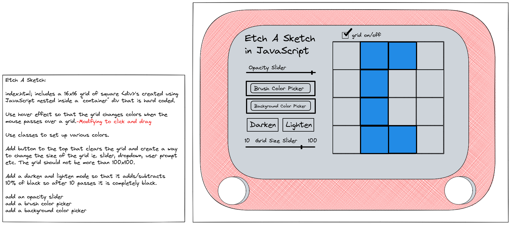

# Etch A Sketch in JavaScript

## Overview
Etch A Sketch in JavaScript is a simple doodle script that will utilize a grid of cells that will allow you to write/draw on by clicking and dragging to fill in the cells with the color of your choice.

### Features
* Darken and Lighten mode (adds +/- 10% per stroke in white or black) -NOTE: You must click the buttons for either darken or lighten (or both) to increase the darkness/lightness. Pressing the clear button will reset the darken/lighten buttons.
* Color pickers for paint brush and background
* Adjustable canvas size (10x10 minimum up to 100x100)
* Grid on/off checkbox

## Background
This app is part of The Odin Project, specifically, the Etch A Sketch project in the Foundations section on [The Odin Project](https://www.theodinproject.com). The project is designed to promote use of the newly-learned DOM manipulation in combination with all previous lessons on HTML, CSS, and JavaScript. 

## Planning
This app will utilize a combination of JavaScript, CSS, and HTML. The following image is a reflection of the initial planning and what the final product will look like.  

## License
This app is open source and you are free to use the code in any manner you choose. The only exception is you may not use any portion of my code for profit. 